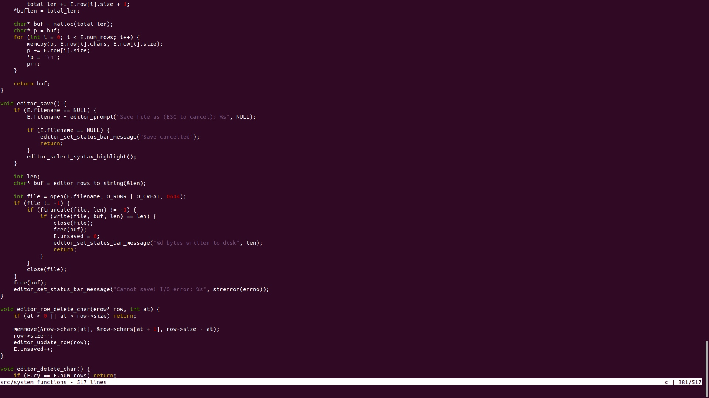

## Building and running

Use this command to build:

> ./text_editor.sh

You can specify the name of the file you want to open:

> ./text_editor my_file.txt

## Switching modes
The editor has three working modes:
- __DEFAULT__ mode for file navigation (use __ESC__ to change your mode to default)
- __INSERT__ mode for deleting/adding characters to your file (__i__ to change your mode to insert)
- __SEARCH__ mode to search for a certain character/word/sentence in your file (use __s__ to switch to search)

Saving and exiting:

- __Ctrl+s__ to save your file
- __Ctrl+q__ to exit the editor

## DEFAULT mode
Buttons for file navigation:
 - Use buttons __h__, __j__, __k__ and __l__ to move your cursor left, up, down and right
 - __J__ to skip one screen of text or __K__ to go one page up
 - __H__ to go to the beginning of the current line, __L__ to go the end of the current line

### That is how the redactor looks for now
